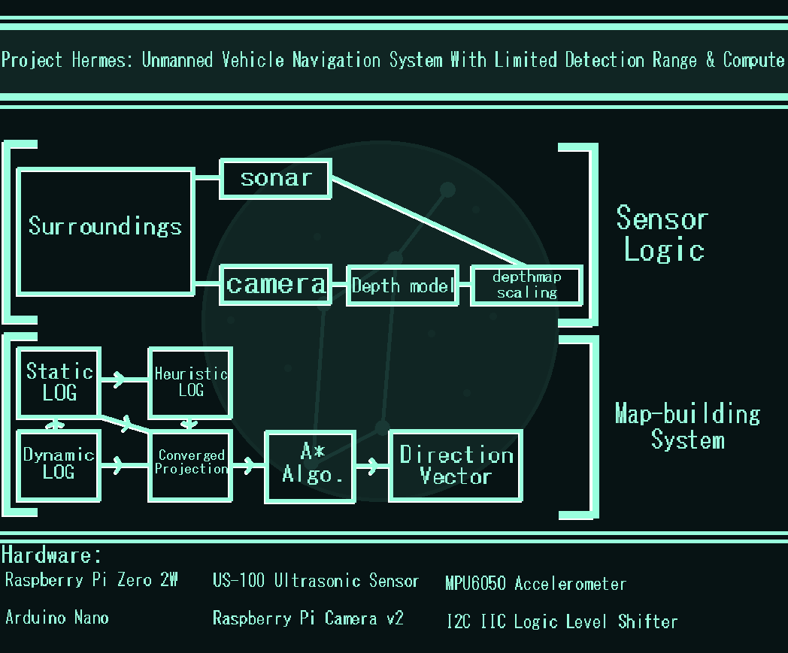
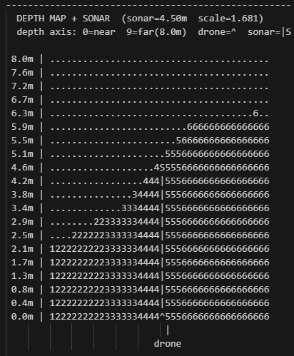
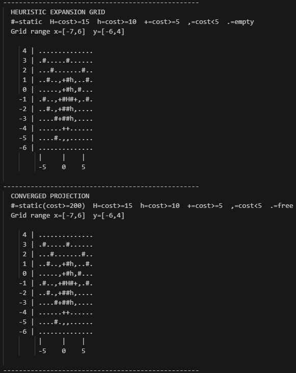
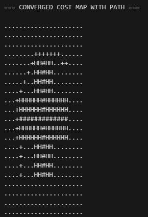

# Project Hermes 
A drone navigation algorithm using three different representations of it's surroundings with limited sensor capabilities.

The system is split into two seperate subsystems, pathfinding and movement calculation. In the hardware I used for this project, the pathfinding algorithm runs on Rasberry Pi and the Movement Calculation file runs on Arduino.
## Architecture

### Sensor Handling
The accelerometer is the only instrument used for handling position, using data of the vehicle's acceleration to map it's relative position to it's starting location. Visual odometry could also be used for this, however given the limited computational power available this was decided against. On a more capable system visual odometry would work greatly alongside accelerometer data, being able to ground it against noise.

The Camera module is used to create a map of the surrounding area in the form of a depth grid via monocular depth estimation. It also uses a sonar sensor to appropriately scale this depth grid to align with the observed ground-truth of a given point at the center of the depth map, which the sonar measures the distance to from the vehicle.

### Pathfinding Algorithm

This scaled depth grid is then raycasted onto a Layered Occupancy Grid, specifically the one intended for Dynamic obstacles, or the DOG. The points are mapped onto the grid via a direction vector, using the drones relative x, y, and z position as well as it's direction relative to the starting point to plot a point in a grid projection anchored at the starting point. There are also three bounds limiting how far the drone can explore or expand it's map.

The Pathfinding algorithm is split into 3 main projections; those being the dynamic(DOG), static(SOG), and heuristic(HOG) projections. The dynamic projection is where points are mapped upon being located via the depth grid, and should the drone's confidence score that the point is static increase to a certain threshold (0.8) it will transfer that point to the static map, with no decay unlike the dynamic one. This is due to it's nature as being a way of mapping static and permanent terrain essential to the vehicle's navigation capabilities. The heuristic map is based upon the static one, using four algorithms to perdict a conservative estimate of it's surroundings outside of what has already been observed. These projections are combined to form the converged projection, which the Astar algorithm uses to have a comprehensive view of it's surroundings rather than the isolated static/dynamic grids.

### Inter-Microcontroller Communication
There are two microcontrollers intended for the Hermes system, those being the Raspberry Pi 2W (but can be any model) as well as the Arduino Nano (but can be any model). This is facilitated by the I2C ICC Logic Level Shifter, which converts the 3.3v signal of the Pi to a 5v format readable to the arduino. Via this bridge, the Arduino sends a variety of states (idle, ready, executing, complete) pertaining to the motors. The Pi, receiving these states, can wait to send a command to the Arduino, or can override states.
## GPIO Pinout
- GPIO 2: SDA on MPU6050
+ GPIO 3: SCL on MPU6050
* GPIO 23: TX on US-100
- GPIO 24: RX on US-100
+ GPIO 14: HV3 on I2C IIC
* GPIO 15: HV2 on I2C IIC
